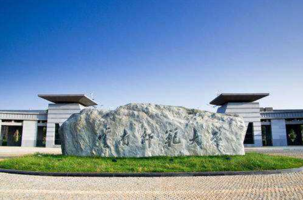
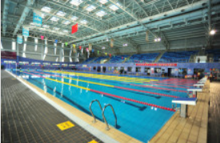
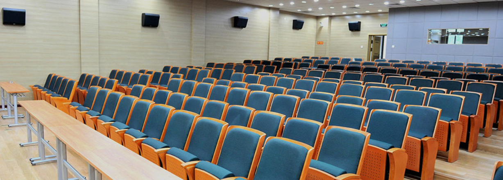
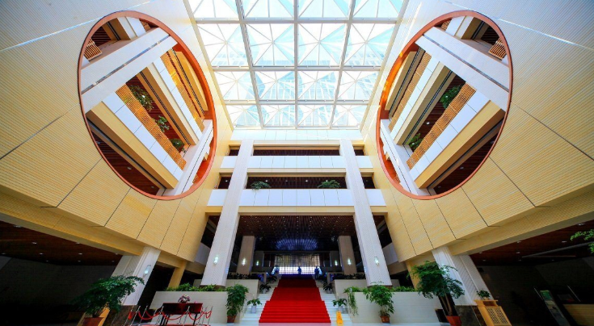
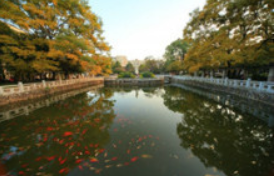
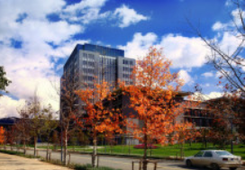
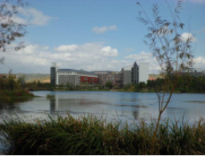

<!DOCTYPE html>
<html lang="zh-CN">
	<head>
		<meta charset="utf-8">
		<meta http-equiv="X-UA-Compatible" content="IE=edge">
		<meta name="viewport" content="width=device-width, initial-scale=1">
		<meta name="description" content="">
		<meta name="author" content="">
		<link rel="icon" href="../../favicon.ico">
		<title>我的学校</title>
		
		<link rel="stylesheet" type="text/css" href="bootstrap-3.3.7-dist/css/bootstrap.css" />
		
	</head>

	<body>
		<nav class="navbar navbar-inverse navbar-fixed-top">
			

				

					<a class="navbar-brand" href="#">我的学校--云南师范大学！</a>
					
<a class="btn btn-primary btn-sm" id="btn-more" role="button" href="https://solar.ynnu.edu.cn/info/1015/1457.htm">学校官网>></a>

				

			

		</nav>

		

			

				<h3>云南师范大学</h3>
				

					云南师范大学（Yunnan Normal
					University），简称“云师大”，坐落在云南省昆明市，是一所省属重点师范大学，由中华人民共和国教育部和云南省人民政府共建，入选国家“中西部高校基础能力建设工程”重点建设高校、中国政府奖学金来华留学生接收院校，是全国免费师范生试点改革的三个地方高等师范院校之一、首批教育部来华留学示范基地建设高校和“卓越教师培养计划”实施高校，全国第二批深化创新创业教育改革示范高校，被誉为“红土高原上的教师摇篮”。
					云南师范大学的前身可追溯到诞生于1938年（戊寅年）的国立西南联合大学师范学院；1950年国立昆明师范学院更名昆明师范学院；1984年更名为云南师范大学。 
				

				

					据2019年12月学校官网显示，学校占地面积3300亩，下设24个学院，2个独立学院，28所附属和合作办学的中小学、幼儿园，40余个科研机构；有全日制博士、硕士研究生和本科生32000余人，成人继续教育学生16000余人；图书馆藏书资料340余万册；有有93个本科专业17个省级重点学科，6个省级一流学科，2个博士后科研流动站，4个一级学科博士学位授权点，1种博士专业学位授权点，1个未获一级学科授权的二级学科博士学位授权点，28个一级学科硕士学位授权点，16种硕士专业学位授权点；有教职工2400余人，高级职称887人。
				

				

					
				

			

		

		

			

				<h3>我校设备及环境</h3>
				

					有呈贡主校区和一二一西南联大校区2个校区，占地较大。校内有图书管、游泳池等，环境优美、安静，是个学习的好地方！欢迎大家来参观！
				

				

					

						<h5 class="img-title">游泳馆</h5>
						
					

					

						<h5 class="img-title">多媒体教室</h5>
						
					

					

						<h5 class="img-title">图书管内景</h5>
						
					

				

				
				

					

						<h5 class="img-title">校内湖泊</h5>
						
					

					

						<h5 class="img-title">呈贡校区</h5>
						
					

					

						<h5 class="img-title">校内湖泊（不同角度哦）</h5>
						
					

				

			

		

		<footer>
			
想要了解云南师范大学更多信息吗？想要了解我的校园生活吗？A.A&nbsp;&nbsp;&nbsp;&nbsp;请加我qq 2552***7267

		</footer>
	</body>
</html>
